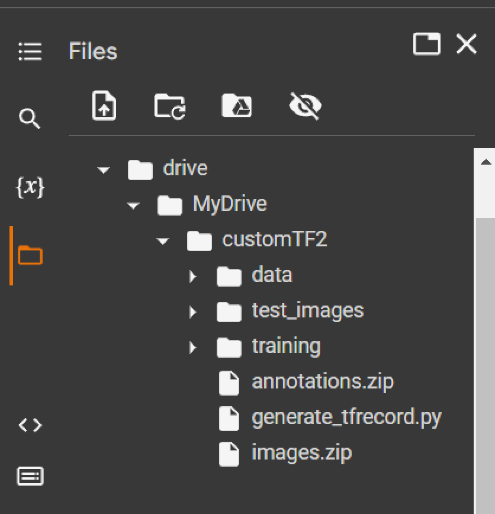
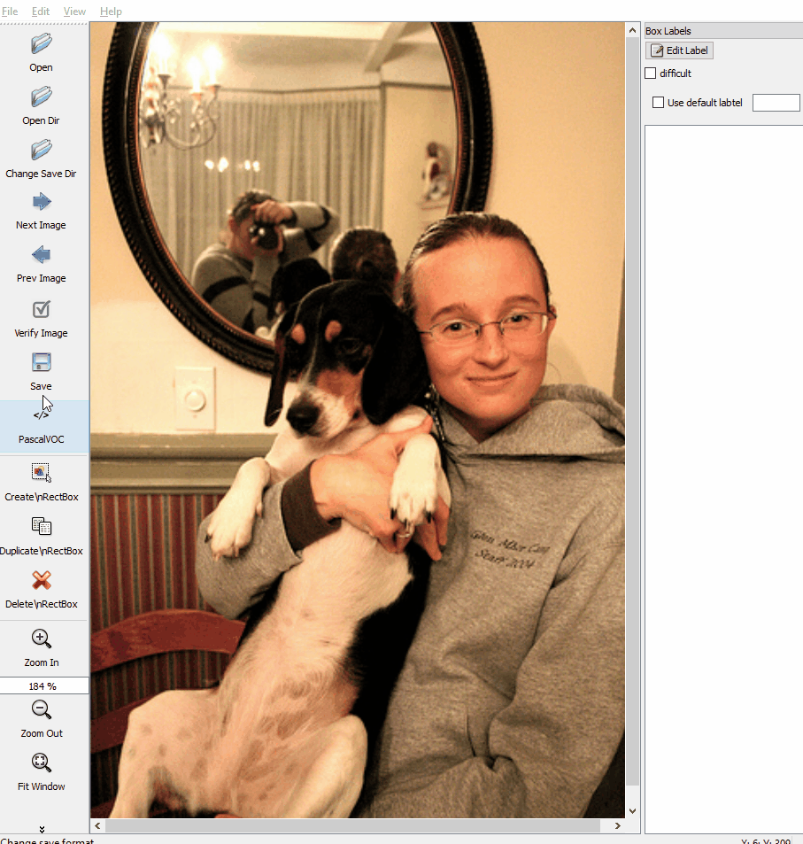
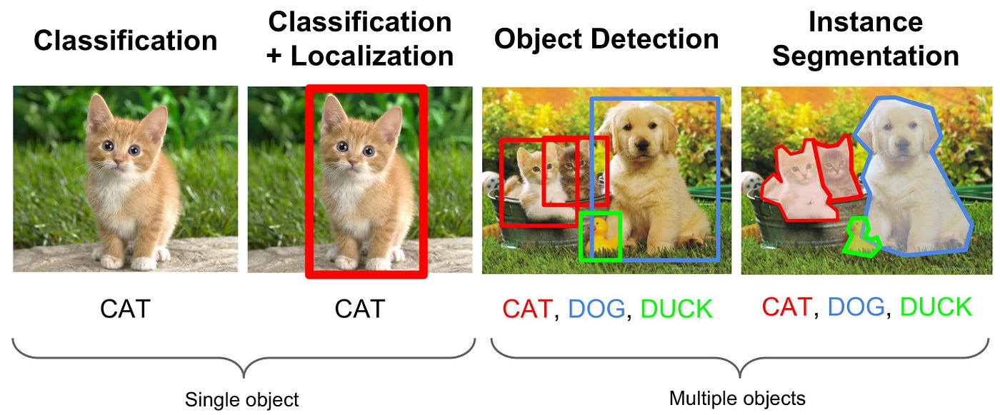

# **Custom-Object-Detection-Notebook**
This jupyter notebook trains a TensorFlow 2 custom object detection model. You can choose your own data set to make a model that can recognize those set of images, as long as they are properly labelled.

This jupyter notebook is meant to be run on Google Drive, and using Google Colab as the environment.

---
 

## **Before running the notebook, make sure to have the following directories in your  G-Drive.** ##

1.  Create a folder named customTF2 in your google drive.

2. Create another folder named training inside the customTF2 folder (the training folder is where the checkpoints will be saved during training).

3. Create another folder named data inside the customTF2 folder.

4. Create a folder named images for your custom dataset images and create another folder named annotations for its corresponding PASCAL_VOC format labeled XML files.

5. Create their zip files and upload them to the customTF2 folder in your drive.

6. After attaching your drive, your directory should look something like this: 

  

## **Image annotation to get PASCAL_VOC XML file**
 **Image annotation** is the process of labeling or classifying an image using text, annotation tools, or both, to show the data features you want your model to recognize on its own.

 

 You can check out the [Github repo for LabelImg](https://github.com/heartexlabs/labelImg), or read more about image labeling [here](https://viso.ai/computer-vision/labelimg-for-image-annotation/).

  

## **Object Detection vs Image Classification vs Image Segmentation**

Computer Vision is a field of computer science that focuses on enabling computers to identify and understand objects and people in images and videos. Object Detection, the focus of this notebook, is concerned with detecting instances of objects of a certain class in digital images. It involves both classification and localization of the multiple objects present in an image, as long as the model is trained to recognize those objects.

  

## **Base Model Used**

Because training computer vision models take a lot of time and resources, **Transfer Learning** helps solve this problem by using existing models and "transferring" or recycling the learned patterns or knowledge developed from previous training to help perform a new task.

For our project, our team used the **[ssd_mobilenet_v2_fpnlite_320x320_coco17_tpu-8](https://github.com/tensorflow/models/blob/master/research/object_detection/configs/tf2/ssd_mobilenet_v2_fpnlite_640x640_coco17_tpu-8.config)** , trained on the [COCO 2017 dataset](https://cocodataset.org/#explore), as the base for our custom object detection model. 

You can also try using different base models. A list of detection checkpoints for tensorflow 2.x can be found [here](https://github.com/tensorflow/models/blob/master/research/object_detection/g3doc/tf2_detection_zoo.md).

  

## **ROADMAP TO CREATING AN OBJECT DETECTION TFLITE MODEL**
* Collect the dataset of images and label them to get their xml files.

* Install the TensorFlow Object Detection API.
* Generate the TFRecord files required for training. (need generate_tfrecord.py script and csv files for this)
* Edit the model pipeline config file and download the pre-trained model checkpoint.
* Train and evaluate the model.
* Export and convert the model into TFlite(TensorFlow Lite) format.
* Deploy the TFlite model on Android / iOS / IoT devices.

  